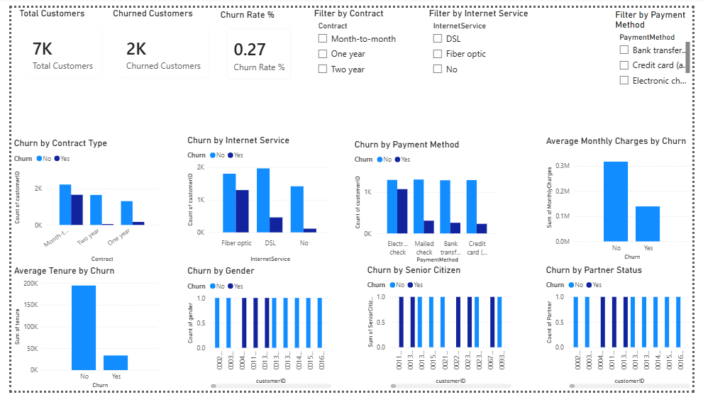

# 📊 Customer Churn Analysis

##  Overview

This project focuses on analyzing customer churn in a telecom company using Python, SQL, and Power BI. The objective is to identify the major factors influencing customer churn and provide business recommendations to improve customer retention.

---

##  Project Objective

The goal of this project is to:

- Clean and prepare customer data
- Perform Exploratory Data Analysis (EDA)
- Analyze customer churn using SQL
- Build an interactive Power BI dashboard
- Generate actionable business insights

---

##  Tools & Technologies

- Python
- Pandas
- NumPy
- Matplotlib
- Seaborn
- MySQL
- SQL
- Power BI
- GitHub

---

##  Dataset

- **Dataset:** Telco Customer Churn
- **Records:** 7,043 Customers
- **Columns:** 21 Features

Key attributes include:

- Gender
- Senior Citizen
- Partner
- Dependents
- Tenure
- Internet Service
- Contract
- Payment Method
- Monthly Charges
- Total Charges
- Churn

---

#  Project Workflow

```
Raw Dataset
      │
      ▼
Data Cleaning (Python)
      │
      ▼
Exploratory Data Analysis (EDA)
      │
      ▼
SQL Business Analysis
      │
      ▼
Power BI Dashboard
      │
      ▼
Business Insights
```

---

#  Python Tasks Performed

- Imported dataset
- Checked missing values
- Cleaned data
- Converted data types
- Performed Exploratory Data Analysis
- Calculated churn rate
- Identified churn patterns
- Generated business insights

---

#  SQL Analysis

The following analyses were performed:

- Total Customers
- Churn Rate
- Contract Type Analysis
- Internet Service Analysis
- Payment Method Analysis
- Monthly Charges Analysis
- Tenure Analysis

---

#  Power BI Dashboard

### KPI Cards

- Total Customers
- Churned Customers
- Churn Rate

### Dashboard Visuals

- Churn by Contract Type
- Churn by Internet Service
- Churn by Payment Method
- Average Monthly Charges by Churn
- Average Tenure by Churn
- Churn by Gender
- Churn by Senior Citizen
- Churn by Partner Status

### Slicers

- Contract
- Internet Service
- Payment Method

---

#  Key Insights

- Customers with Month-to-Month contracts have the highest churn.
- Fiber Optic customers show a higher churn rate than DSL users.
- Electronic Check customers churn more frequently than customers using other payment methods.
- Customers paying higher monthly charges are more likely to churn.
- Customers with shorter tenure have a significantly higher churn rate.

---

#  Business Recommendations

- Encourage customers to switch to long-term contracts.
- Improve customer support for Fiber Optic users.
- Offer loyalty rewards to new customers.
- Review the Electronic Check payment process.
- Develop targeted retention campaigns for high-risk customers.

---

# 📸 Dashboard



---

#  Project Structure

```
Customer-Churn-Analysis/
│
├── Data/
├── Notebook/
├── SQL/
├── PowerBI/
├── Images/
├── README.md
```

---

#  Skills Demonstrated

- Data Cleaning
- Data Analysis
- Exploratory Data Analysis (EDA)
- SQL Query Writing
- Data Visualization
- Dashboard Development
- Business Intelligence
- Data Storytelling

---

#  Author

**Varshini A**

M.Sc. Applied Data Science

Python | SQL | Power BI | Data Analytics
